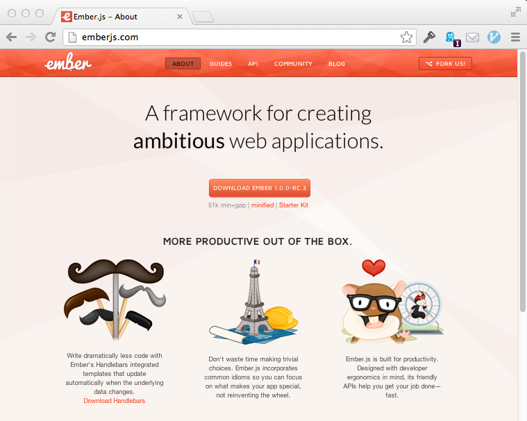

# ember-rails hands-on intro

!SLIDE

# ember-rails hands-on intro

## Matt Gauger

### Mad Railers 2013-05-20

!SLIDE

## I work at Bendyworks


<div class="notes">
Stephen, my boss here at Bendyworks, asked me to give this talk after I gave a brownbag technical talk on Ember-rails and how I'd used it for the Snow Mobile Raffle app.

I want to show you how easy it is to include Ember-rails into your Rails app, and to use the default generators to start building your Ember app. And I'll have some lessons learned at the end.
</div>

!SLIDE

## Disclaimer:

### I spend most of my time writing Backbone code that talks to Ruby services right now

<div class="notes">
Quite a few of us on the Bendyworks team have been writing Backbone since late last year on a big project for a client, and so I'm most familiar with Backbone.

I have a lot of good things to say about Backbone, and a lot of hope for Ember. I don't always have good thing sto say about either Ember or Backbone, though.
</div>

!SLIDE

## What is Ember.js?

A framework for JS MVC apps

<div class="notes">
So Ember.js is a framework for JS MVC apps
Or, another way of architecting these fancy websites we keep trying to build
- We're building more complicated apps.
- More work is being done on the clientside.
- We're integrating with more external APIs where we don't control the server.
- It's cool!
</div>

!SLIDE


<div class="notes">
If you're curious, you can go hit up the ember.js website.
Their guides have gotten much better and their documentation for functions and classes is better now than it used to be, too.
</div>

!SLIDE

## Why Ember.js?

<div class="notes">
Why do we need another JS MVC framework?

One size does not fit all.
Ember has some unique features that take the burden of uninteresting problems off the developer.
For example, Ember binds elements that change to DOM elements and updates them for you -- you don't have to call `render` like in other frameworks. I'll talk more about this later.
</div>

!SLIDE

## MVC => Model, View, Controller

<div class="notes">
So what does this really mean for a JS app?

This is going to be for a JavaScript MVC app, which is a little different than what Rails considers MVC.
</div>

!SLIDE

## MVC => Model, View, Controller

(Let's not get in a debate as to whether it's really MVC when we say JS MVC, ok?)

!SLIDE

## Templates

### Strings that we will render with data to present the user interface
#### (Note: not in the acroynm)

<div class="notes">
In Rails, this is what we call the View.. notice how we never write a View class in Rails? You could, but you don't have to.
</div>

!SLIDE

## View classes

### Translates browser events to application events
### Binds data to a template

!SLIDE

## Controller classes

### Stores representations of application state
#### ie, a collection of model instances that came back from our API

!SLIDE

## Model classes

### Stores persistant state
#### Typically loaded and saved to a server, but doesn't have to be


!SLIDE

## Router and route classes

### Manages application state
#### Most importantly, handles URLs and sends messages the correct Controller for what is being requested

!SLIDE

## How does Ember.js compare to other frameworks?

!SLIDE

## Favors convention-over-configuration

### Like Rails!

!SLIDE

## Opinionated about what your API should look like

### This is the volatile `ember-data` project; now a part of Ember.js itself

<div class="notes">
Other frameworks let you define the API and how you talk to it. But that's at the expense of developer time -- now you have to spend time maintaining your mapping to your API in addition to the business logic!
</div>

!SLIDE

## Ember handles rendering and re-rendering DOM elements that are bound to data

### Other frameworks leave calling `render` up to you

<div class="notes">
As a result, this means that Ember performs best when it takes over the entire viewport.

This is unlike other frameworks in that you can't just use the framework for part of your page. It wants to be the whole app.
</div>

!SLIDE

## Push state (history), URLs are handled by Ember by default

### Other frameworks let you turn this on.

!SLIDE

## Ember.js is a whole framework

### Other frameworks (like Backbone) are more like LEGO blocks in my opinion.
#### You can combine those frameworks in many ways.
#### Ember has a set of reasonable defaults it expects you to play with.

!SLIDE

## What does a simple Ember.js application look like?

``` javascript

App = Ember.Application.create();

App.Person = Ember.Object.extend({
  firstName: null,
  lastName: null,

  fullName: function() {
    return this.get('firstName') +
           " " + this.get('lastName');
  }.property('firstName', 'lastName')
});

App.IndexRoute = Ember.Route.extend({
  model: function() {
    var people = [
      App.Person.create({
        firstName: "Matt",
        lastName: "Gauger"
      })
    ];
    return people;
  }
});
```

!SLIDE

## Thanks! Questions?

### I am:
### [twitter.com/mathiasx](https://twitter.com/mathiasx)
### [github.com/mathias](https://github.com/mathias)

### This presentation lives at:
### [blog.mattgauger.com/madrailers-ember-rails/](http://blog.mattgauger.com/madrailers-ember-rails/)
### Outline (with notes):[gist.github.com???](#)
